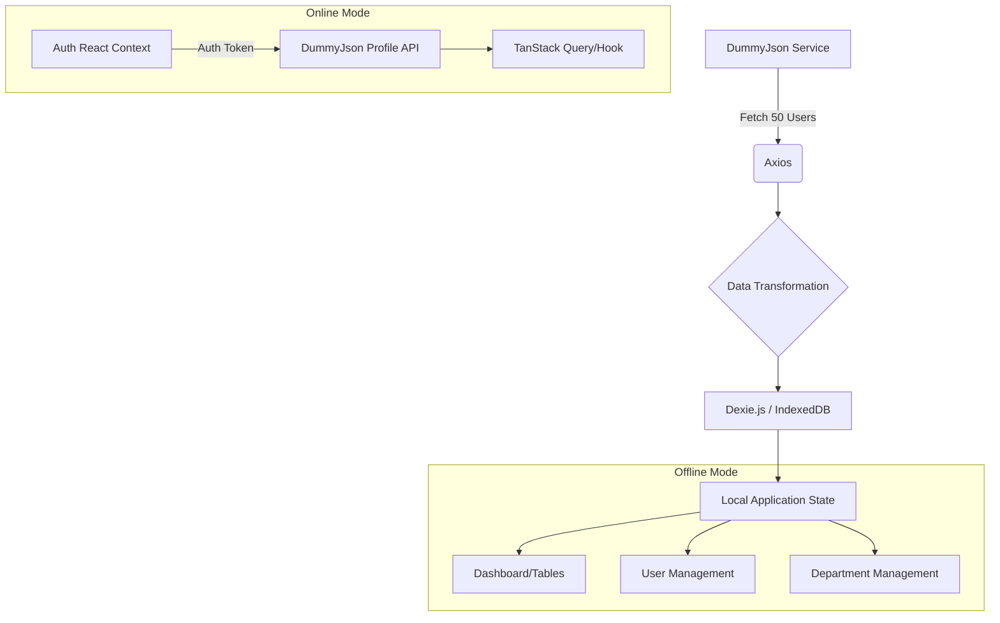

# Cognitive Debt

Cognitive Debt is an open-source project created as a mentorship initiative by [Aubay Portugal](https://www.aubay.pt/en) to help me, [Roberto Costa](https://github.com/betocostadev/betocostadev) recover my core development skills after too much AI usage in an extensive project.

[![App Cover][app-cover-image]][app-cover-image]

[app-cover-image]: ./app-cover.jpeg

## The Concept

In an era dominated by AI-assisted coding (Claude, Copilot, Devin), many developers have inadvertently created a "cognitive debt"—a reliance that leads to forgetting fundamental programming techniques and losing touch with the underlying codebase. Furthermore, the "Slot Machine" effect of iteratively prompting AI until the output is "good enough" has been linked to increased developer burnout and decreased job satisfaction.

Cognitive Debt is a deliberate exercise in low-AI development. The codebase was built through manual effort, utilizing AI only as a last resort after extensive manual debugging, with guidance and mentorship provided by [Flávio da Maia Jr](https://github.com/flaviodamaiajr).

## Architecture & Data Flow

The application simulates an enterprise environment.

It uses the DummyJson service for initial authentication and data seeding, after which the application transitions to a fully offline-first experience using Dexie.js and IndexedDB.

## How It Works

1. Authentication: Simulates an auth flow via DummyJson.

2. Seeding: Fetches 50 users via Axios and stores them alongside department data in IndexedDB via Dexie.js.

3. Offline Functionality: With the exception of real-time profile fetching, all interactions (navigating dashboards, CRUD operations on users, viewing department structures) are handled locally within the browser.

## Features

**Navigation**: Seamless routing between Dashboard, About, Help, Users, and Departments.

**User Management**: Full CRUD (Create, Read, Update, Delete) capabilities for the user directory.

**Department Management**: View comprehensive lists of departments and their associated employee hierarchies.

**Offline-First**: Robust local state management allowing for high-performance data operations without server round-trips.

### Tech Stack

- TypeScript 6.0
- Vite 8.0
- Vitest 4.1
- React 19.2 with TanStack Start
- Tailwind
- TanStack Query
- TanStack Router
- Axios (Fetches initial data from Dummy Json)
- Lucide React (Icons)
- Dexie.js
- React Hook Form (with Zod)
- Recharts
- Sonner

## Mentorship & Credits

Mentee: [Roberto Costa](https://github.com/betocostadev/betocostadev)

Mentor: [Flávio da Maia Jr](https://github.com/flaviodamaiajr)

Initiative: [Aubay Portugal](https://www.aubay.pt/en)

[app-cover.jpeg]: app-cover.jpeg
